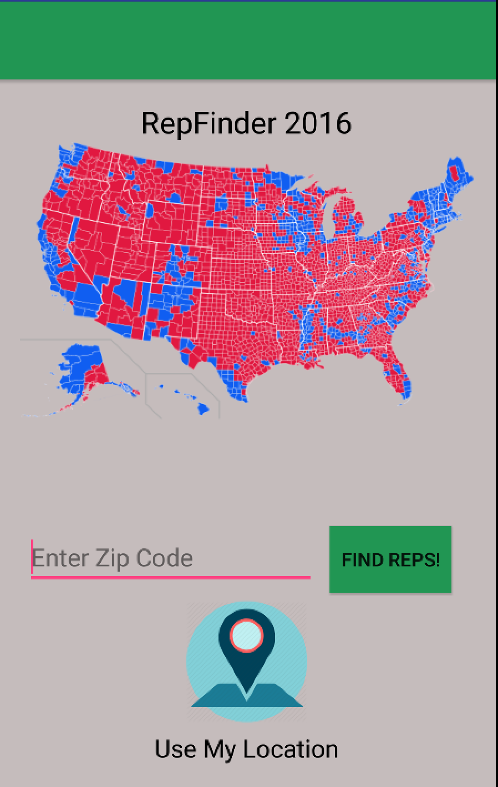

# PROG 02: Represent!

Find your congressional representatives! Use either your zip code or current location and find out who you are voting for!!! Not every representative plays by the rules. 

## Authors

Sunny Singh ([sunny.singh.13@berkeley.edu](mailto:sunny.singh.13@berkeley.edu))

## Demo Video

See [RepFinder 2016] (https://www.youtube.com/watch?v=pnVv8szGPpQ)

## Screenshots

## Acknowledgments

* http://stackoverflow.com/questions/11050074/how-to-check-if-radiobutton-is-checked

* http://stackoverflow.com/questions/9605459/android-why-must-use-getbasecontext-instead-of-this

* http://stackoverflow.com/questions/3641304/get-latitude-and-longitude-using-zipcode

* http://developer.android.com/training/wearables/ui/2d-picker.html

* All APIs Used (SunLight, Google Location, etc.)

* CS 160 TAs

* Anyone else I forgot :)

